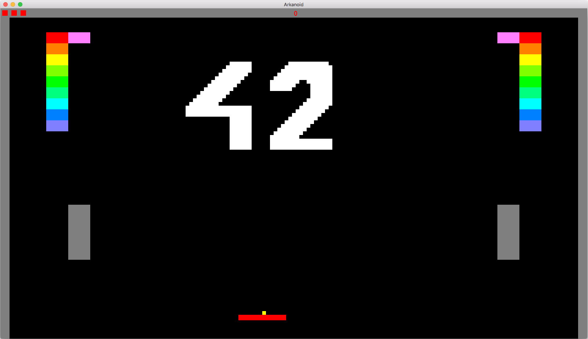
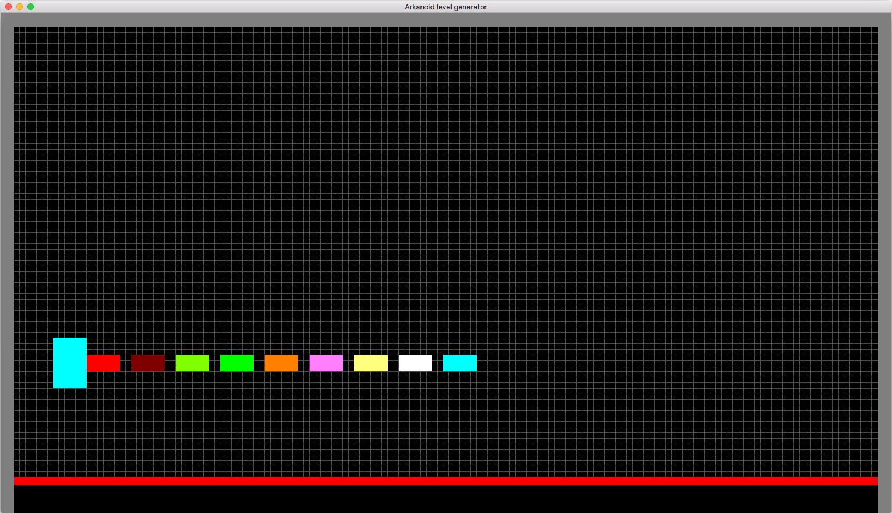
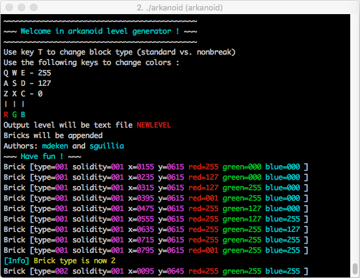

# 42-arkanoid
#### Two days to hit bricks

This was a so-called 'rush', a coding week-end dedicated to a particular technology, in this case OpenGL.

We've made a breakout game... and it works !

There is also a level generator...

Thanks to my teammate, [mdeken](https://github.com/madeka/) !
